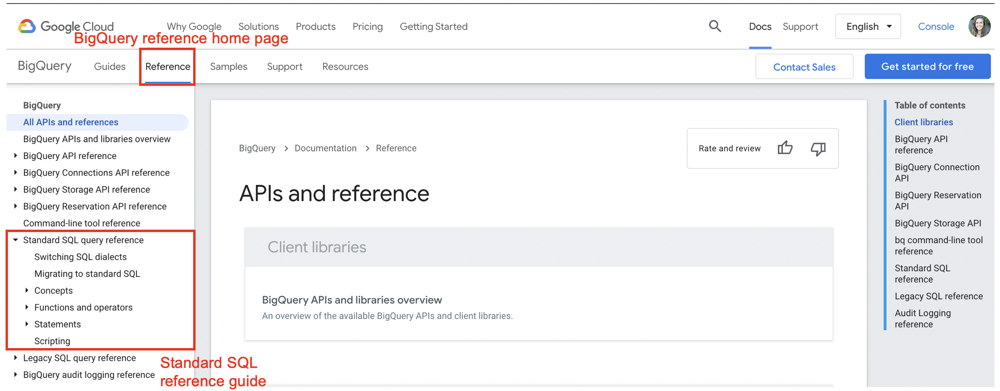
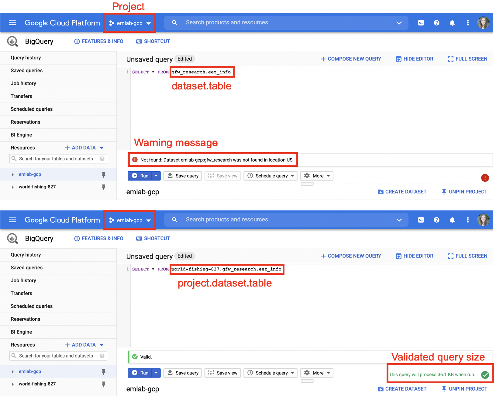
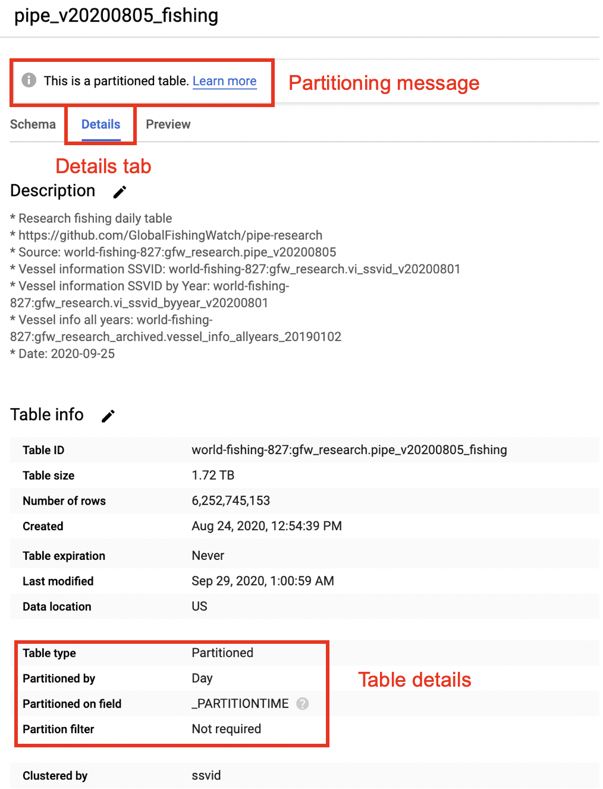
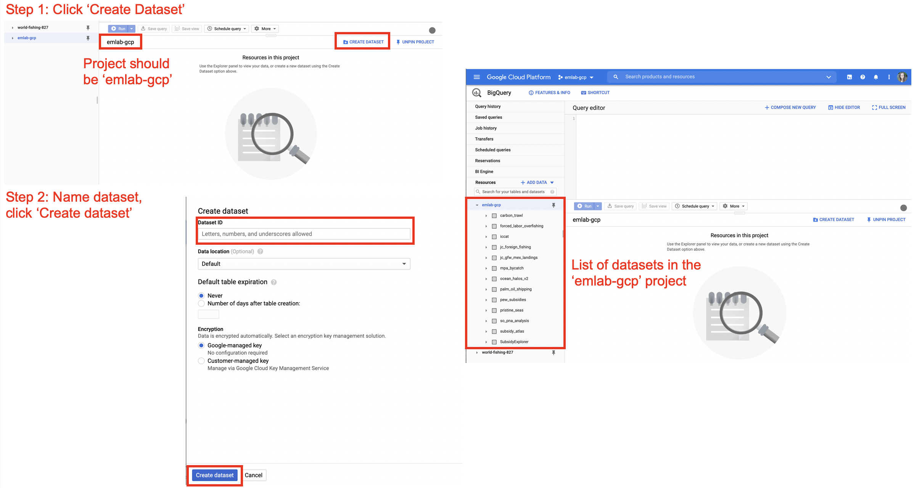
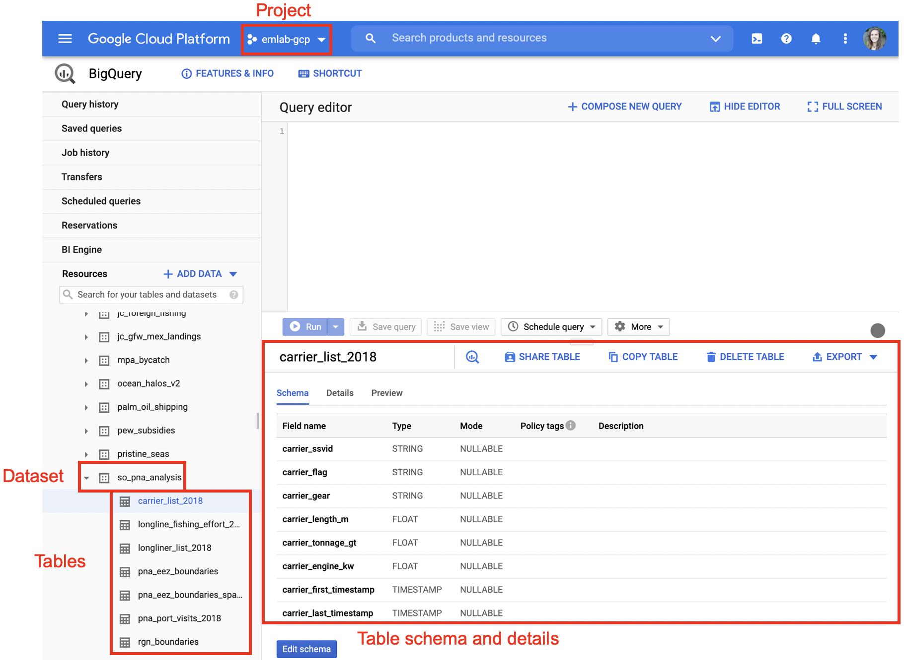

# Workflow

There are many ways to access and use GFW data and while there is no one set way, this section contains some tips on streamlining workflow between BigQuery and R. Best practices for style and reproducibility in R are outlined in the emLab SOP [Section 4](https://emlab-ucsb.github.io/SOP/4-code.html).  

## Validation with BigQuery

The BigQuery console provides a friendly interface to check for query sizes and to validate queries for syntax errors. Queries can then be copied into markdowns or scripts in R for reproducibility. Queries can be executed in R and data can either be written to a table in the `emlab-gcp` project in BigQuery or downloaded directly to the local R working environment. 

## Using BigQuery in R

There is no single best way to access and use GFW data in R. Below are a few techniques that can be used depending on personal preference and project needs. While it is possible to use GFW data without writing SQL using the `dbplyr` package, this document focuses on workflow to integrate SQL into R. 

BigQuery can understand both Standard and Legacy SQL. Best practice to use *Standard SQL*. BigQuery has a very helpful [Reference Guide](https://cloud.google.com/bigquery/docs/reference) for functions and operators in Standard SQL. In particular, the ‘Functions and Operators’ section, found under the ‘Standard SQL query reference’ heading, contains helpful documentation on a range of functions categorized by type.  

{height="50%" width="50%"}  

### Authorization 

BigQuery requires authorization to execute functions in R. Running the `bq_auth()` function from the `bigrquery` package in the console will open a new tab in your web browser allowing you to authenticate your credentials. BigQuery will cache your credentials for use in the future, but it is still necessary to run `bq_auth()` each time you start a new Rproject. If you forget to authenticate your credentials before trying to execute a query, BigQuery will produce an error message.   

### Accessing Data

When writing SQL data can be accessed using three pieces of information: the project, the dataset, and the table. This should follow the syntax project.dataset.table. Specifying the project first is important. SQL will only be able to find datasets and tables within the billing project (e.g. `emlab-gcp`) if no project is specified. For example when `emlab-gcp` is set as the billing project, trying to access the `eez_info` table using `gfw_research.eez_info` produces an error that the table does not exist. Adding the project first, `world-fishing-827.gfw_research.eez_info` fixes the query. 

{height="50%" width="50%"}  

Best practice is to always specify the project since this reduces potential errors if others replicate your code using a different billing project.   

### Writing and Executing Queries

There are two main methods for executing SQL in R. One is to write the SQL query as a string and then execute it using the bigrquery or DBI packages. The second is to use an SQL chunk within your markdown or notebook. The following libraries are useful for accessing GFW data: `DBI`, `bigrquery`, `glue`.  

*Writing Queries as Strings*    

Queries can be written as strings in R. Best practice is to avoid looped or nested queries and instead use subqueries. Subqueries can be written using ‘WITH’ statements. 

[Code example]  

Using `glue::glue_sql()` allows for substitution of R variables into the query. 

[Code example]  

The queries can be run using the `bigrquery` package or the `DBI` package. When using `bigrquery`, the `bq_project_query()` function enables you to run the query and only requires the billing code and the query string. This function will not download the results of your query. To run the query and download results locally you can combine the `bq_project_query()` and `bq_table_download()` functions. More information is available in the package [documentation](https://cran.r-project.org/web/packages/bigrquery/bigrquery.pdf).  

[Code example]  

A second option is to connect to BigQuery using the `DBI` package. When using DBI you first setup the connection using `dbConnect()` and then you can run your query using `dbGetQuery()`. More information about `DBI` is available in the package [documentation](https://cran.r-project.org/web/packages/DBI/DBI.pdf).  

[Code example]  

*Using SQL Chunks*  

Both R markdown and R notebooks allow for integration of prose and different programming languages, such as python or SQL, within one document. Selecting “Insert → SQL” will add a code chunk to the document and enable you to write in SQL directly instead of saving the query as a string. Note you may need to change your settings to ‘Chunk output inline’ if using R markdown to ensure you can view the results of your queries without knitting the document. 

When using SQL code chunks, it is important to specify the database connection and the output variable within the top of the code chunk. The database connection is established in the same way as shown above with `DBI::dbConnect()`. 

[Code example]  

### Subsetting Data 

Some queries may be expensive to run and output large amounts of data. To check results from queries or to make sure they work correctly, it may be necessary to subset the data. Tables that are partitioned are divided up into smaller segments and can be easily subsetted to reduce query size and cost. A common technique for subsetting data is to restrict the date range to a single day. This can be accomplished using WHERE plus a date filter (like _PARTIONTIME) although the specific notation will depend on if the data are represented as a date or a timestamp. Partitioned tables are noted in Section 3 and more information on partitioned tables can be found in the BigQuery [documentation](https://cloud.google.com/bigquery/docs/partitioned-tables?_ga=2.76664789.-1147900105.1599252261).  

[Code example]  

While there are other techniques for subsetting such as using a list of ssvids, specifying flags, or restricting to a certain gear type, these will not reduce the size and cost of the query. Only filtering based on a partitioned column will affect the size of the query. Generally, partitioned tables are noted in BigQuery with a message under the ‘Details’ tab and more information about how the table is partitioned is available in the Table Info.    

{height="50%" width="50%"}  

### Saving / Downloading BigQuery Tables

In some cases you might want to save your query results directly to BigQuery. For example, it may be easier to store large tables in BigQuery than trying to work with large amounts of data in R. A large table can then be further queried and subsetted before working with the data in R. Additionally, it may be useful to store tables in BigQuery if you plan to join them with other data  stored in BigQuery. For instance, a table of spatial boundaries may be useful to store on BigQuery for spatially filtering data from other BigQuery tables to a specific region of interest. Tables can be saved to BigQuery using either `bigrquery::bq_project_query()` or `DBI::dbWriteTable()`. Using the `bq_project_query()` function allows you to execute the query and save the results as a new table in BigQuery in a single step by adding the `destination_table` argument. When using DBI you need to execute the query first and then write the results to the database.   

Datasets and tables should only be created in the `emlab-gcp` project. Datasets need to be created before tables can be saved there and can be created in the BigQuery console or in R using `bq_dataset_create()`. In the BigQuery console datasets can be created by navigating to the `emlab-gcp` project and selecting the ‘Create Dataset’ button. The default settings for creating the dataset are fine to keep, only the dataset name needs to be added. Once the dataset is created, refreshing the window should show the new dataset on the left hand side nested under the `emlab-gcp` project.   

{height="50%" width="50%"}    

Best practices for naming datasets is to use the official project name, the same one used for the GitHub respository, Google Drive, and other project materials. For tables, names should be descriptive and meaningful. It is advised to follow them emLab SOP guidance in [Section 3.1](https://emlab-ucsb.github.io/SOP/3-1-data-file-naming.html) for file naming, specifically using only lower case letters, using '_' to separate words, and avoiding '-', '.' and other special characters.  

[Code example]  

These tables now live in BigQuery. If you return to the BigQuery console and refresh it, you should see the table nested under `emlab-gcp` and the dataset name.  

{height="50%" width="50%"}     

These tables can now be called directly in future queries and can be downloaded in R at any time using either `bigrquery::bq_table_download()` or `DBI::dbReadTable()`.  

[Code example]  

It is important to remember to save any data at the end of the R session to avoid having to re-run ueries every time you open the project.  

