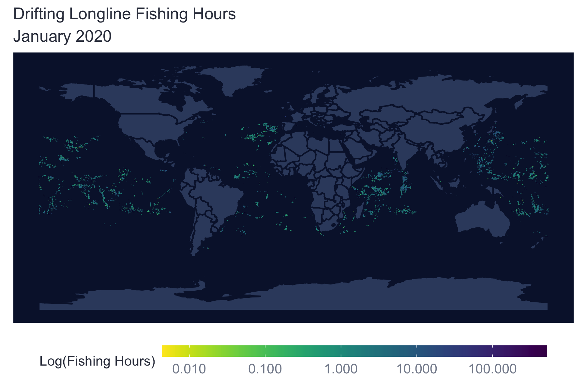

```{r packages, include=F, warning=F, message=F}
library(bigrquery)
library(glue)
library(DBI)

# Set up connection
bq_connection <- dbConnect(
    bigquery(),
    project = "world-fishing-827",
    billing = "emlab-gcp"
)
```

# Workflow

There are many ways to access and use GFW data and while there is no one set way, this section contains some tips on streamlining workflow between BigQuery and R. Best practices for style and reproducibility in R are outlined in the emLab SOP [Section 4](https://emlab-ucsb.github.io/SOP/4-code.html).  

## Validation with BigQuery

The BigQuery console provides a friendly interface to check for query sizes and to validate queries for syntax errors. Queries can then be copied into markdowns or scripts in R for reproducibility. Queries can be executed in R and data can either be written to a table in the `emlab-gcp` project in BigQuery or downloaded directly to the local R working environment. 

## Using BigQuery in R

There is no single best way to access and use GFW data in R. Below are a few techniques that can be used depending on personal preference and project needs. While it is possible to use GFW data without writing SQL using the `dbplyr` package, this document focuses on workflow to integrate SQL into R. 

BigQuery can understand both Standard and Legacy SQL. Best practice to use *Standard SQL*. BigQuery has a very helpful [Reference Guide](https://cloud.google.com/bigquery/docs/reference) for functions and operators in Standard SQL. In particular, the ‘Functions and Operators’ section, found under the ‘Standard SQL query reference’ heading, contains helpful documentation on a range of functions categorized by type.  

{height="50%" width="50%"}  

### Authorization 

BigQuery requires authorization to execute functions in R. Running the `bq_auth()` function from the `bigrquery` package in the console will open a new tab in your web browser allowing you to authenticate your credentials. BigQuery will cache your credentials for use in the future, but it is still necessary to run `bq_auth()` each time you start a new Rproject. If you forget to authenticate your credentials before trying to execute a query, BigQuery will produce an error message.   


### Accessing Data

When writing SQL, data can be accessed using three pieces of information: the project, the dataset, and the table. This should follow the syntax project.dataset.table. Specifying the project first is important. SQL will only be able to find datasets and tables within the billing project (e.g. `emlab-gcp`) if no project is specified. For example when `emlab-gcp` is set as the billing project, trying to access the `eez_info` table using `gfw_research.eez_info` produces an error that the table does not exist. Adding the project first, `world-fishing-827.gfw_research.eez_info` fixes the query. 

{height="50%" width="50%"}  

Best practice is to always specify the project since this reduces potential errors if others replicate your code using a different billing project.   

### Writing and Executing Queries

There are two main methods for executing SQL in R. One is to write the SQL query as a string and then execute it using the bigrquery or DBI packages. The second is to use an SQL chunk within your markdown or notebook. The following libraries are useful for accessing GFW data: `DBI`, `bigrquery`, `glue`.  

*Writing Queries as Strings*    

Queries can be written as strings in R. Best practice is to avoid looped or nested queries and instead use subqueries. Subqueries can be written using ‘WITH’ statements. 

```{r example-query, eval=F}
#############################################################
# Example Query: Find which EEZs vessels fished in 
# Description:
# This query uses the vessel info table to identify all vessels
# that fished in China each year and how much they fished.
#############################################################

sql_vessels_in_china <- "#StandardSQL

WITH

  ###############################
  # Get EEZ ID and info  
  
  eez_names AS (
  SELECT
    CAST(eez_id AS STRING) AS eez,
    reporting_name,
    sovereign1_iso3 AS eez_iso3
  FROM
    `world-fishing-827.gfw_research.eez_info`),

  ###############################
  # Get EEZ fishing summary from activity.eez array 
  
  eez_fishing AS (
  SELECT
    ssvid,
    year,
    best.best_flag,
    best.best_vessel_class,
    value AS eez,
    fishing_hours
  FROM
    `world-fishing-827.gfw_research.vi_ssvid_byyear_v20201209`
  CROSS JOIN
    UNNEST(activity.eez)
  WHERE on_fishing_list_best),

  ###############################
  # Join country name to EEZ id
  
  eez_fishing_labeled AS (
  SELECT
    *
  FROM
    eez_fishing
  JOIN
    eez_names
  USING
    (eez)),

  ###############################
  # Filter to fishing in China using ISO3

  chn_fishing AS (
  SELECT
    * 
  FROM
    eez_fishing_labeled 
  WHERE
    eez_iso3 = 'CHN'
    AND fishing_hours > 0)

  ###############################
  
  SELECT * FROM chn_fishing"

```


The query can be run using the `bigrquery` package or the `DBI` package. When using `bigrquery`, the `bq_project_query()` function enables you to run the query and only requires the billing code and the query string. This function will not download the results of your query. To run the query and download results locally you can combine the `bq_project_query()` and `bq_table_download()` functions. More information is available in the package [documentation](https://cran.r-project.org/web/packages/bigrquery/bigrquery.pdf).  

```{r run-query-bigrquery, eval=F}
# Run query only - stores results to a temporary table in BigQuery
bq_project_query("emlab-gcp", sql_vessels_in_china)

# Run query and download results
vessels_in_china <- bq_project_query("emlab-gcp", sql_vessels_in_china) %>% 
  bq_table_download(max_results = Inf)
```


A second option is to connect to BigQuery using the `DBI` package. When using DBI you first setup the connection using `dbConnect()` and then you can run your query using `dbGetQuery()`. The connection requires the driver (BigQuery), project name, and billing code. More information about `DBI` is available in the package [documentation](https://cran.r-project.org/web/packages/DBI/DBI.pdf).  

```{r run-query-dbi, eval=F}
# Set up connection
bq_connection <- dbConnect(
    bigquery(),
    project = "world-fishing-827",
    billing = "emlab-gcp"
)

# Run query 
vessels_in_china <- dbGetQuery(bq_connection, sql_vessels_in_china)
```

*Writing Queries Using glue*  

Using `glue::glue_sql()` allows for substitution of R variables into the query. Substitute R variables into the query using `{variable}`. Be aware of proper syntax: substituting characters requires using back ticks but numbers or integers don't. This might be useful if, for example, you want to run the same query for different years. Using `glue_sql()` requires adding the connection using the `.con` arguument after the query string. The connection is established in the same way as above, using `dbConnect()`. The query can then be run using either `DBI` or `bigrquery` as shown above.     

```{r example-with-glue, eval=F}
#############################################################
# Example Query: Find which EEZs vessels fished in annually 
# Description:
# This query uses the vessel info table to identify all vessels
# that fished in China in 2019 and how much they fished.
#############################################################


# Define variables
country <- 'CHN'
year    <- 2019

# Write query

sql_vessels_in_china <- glue_sql("#StandardSQL

WITH

  ###############################
  # Get EEZ ID and info  
  
  eez_names AS (
  SELECT
    CAST(eez_id AS STRING) AS eez,
    reporting_name,
    sovereign1_iso3 AS eez_iso3
  FROM
    `world-fishing-827.gfw_research.eez_info`),

  ###############################
  # Get EEZ fishing summary from activity.eez array 
  
  eez_fishing AS (
  SELECT
    ssvid,
    year,
    best.best_flag,
    best.best_vessel_class,
    value AS eez,
    fishing_hours
  FROM
    `world-fishing-827.gfw_research.vi_ssvid_byyear_v20201209`
  CROSS JOIN
    UNNEST(activity.eez)
  WHERE on_fishing_list_best
  AND year = {year}),

  ###############################
  # Join country name to EEZ id
  
  eez_fishing_labeled AS (
  SELECT
    *
  FROM
    eez_fishing
  JOIN
    eez_names
  USING
    (eez)),

  ###############################
  # Filter to fishing in China using ISO3

  chn_fishing AS (
  SELECT
    * 
  FROM
    eez_fishing_labeled 
  WHERE
    eez_iso3 = {`country`}
    AND fishing_hours > 0)

  ###############################
  
  SELECT * FROM chn_fishing", .con = bq_connection)

# Run query 
vessels_in_china_2019 <- bq_project_query("emlab-gcp", sql_vessels_in_china) %>% 
  bq_table_download(max_results = Inf)
```
 

*Using SQL Chunks*  

Both R markdown and R notebooks allow for integration of prose and different programming languages, such as python or SQL, within one document. Selecting “Insert → SQL” will add a code chunk to the document and enable you to write in SQL directly instead of saving the query as a string. In SQL chunks instead of using # to annotate, comments should be enclosed by `/* */` (i.e. `/* Comment */`). 

When using SQL code chunks, it is important to specify the database connection and the output variable within the top of the code chunk. The database connection is established in the same way as shown above with `DBI::dbConnect()`. After running the code chunk, the results should appear in the enviroment using the name of the output variable. 

```{sql connection=bq_connection, output.var = 'vessels_in_china', eval=F}
WITH

  /* Get EEZ id and info */
  
  eez_names AS (
  SELECT
    CAST(eez_id AS STRING) AS eez,
    reporting_name,
    sovereign1_iso3 AS eez_iso3
  FROM
    `world-fishing-827.gfw_research.eez_info`),

  /* Get EEZ fishing summary from activity.eez array */
  
  eez_fishing AS (
  SELECT
    ssvid,
    year,
    best.best_flag,
    best.best_vessel_class,
    value AS eez,
    fishing_hours
  FROM
    `world-fishing-827.gfw_research.vi_ssvid_byyear_v20201209`
  CROSS JOIN
    UNNEST(activity.eez)
  WHERE on_fishing_list_best),

  /* Join country name to EEZ id */
  
  eez_fishing_labeled AS (
  SELECT
    *
  FROM
    eez_fishing
  JOIN
    eez_names
  USING
    (eez)),

  /* Filter to fishing in China using ISO3 */

  chn_fishing AS (
  SELECT
    * 
  FROM
    eez_fishing_labeled 
  WHERE
    eez_iso3 = 'CHN'
    AND fishing_hours > 0)

  /* Select the final query */ 
  
  SELECT * FROM chn_fishing
```


### Subsetting Data 

Some queries may be expensive to run and output large amounts of data. To check results from queries or to make sure they work correctly, it may be necessary to subset the data. Tables that are partitioned are divided up into smaller segments and can be easily subsetted to reduce query size and cost. A common technique for testing queries is to restrict the date range to a single day. This can be accomplished using WHERE plus a date filter (like `_PARTITIONTIME`) although the specific notation will depend on if the data are represented as a date or a timestamp. 

Another option to test queries is to use the `emlab-gcp.emlab_test` dataset. This dataset holds a smaller version of the   
`gfw_research.pipe_vYYYYMMDD_fishing` table containing only data from 2020. This table is meant to allow for testing and checking query results before a full query is run using the `pipe_vYYYYMMDD_fishing` table. The table `pipe_v20201001_fishing_subset2020` is still 485.5 GB so it's recommended to further subset the table when testing out queries. 

Generally, partitioned tables are noted in BigQuery with a message under the ‘Details’ tab and more information about how the table is partitioned is available in the Table Info. In particular, the `partitioned on field` lets the user know what the partitioning field is which can help determine the proper syntax. The figure below illustrates the difference in partitioning fields between the source `pipe_v20201001_fishing` table and the `pipe_v20201001_fishing_subset2020` table. The Table Info for the  `world-fishing-827.gfw_research.pipe_v20201001_fishing` table indicates it is partioned on `_PARTITIONTIME`, which makes `WHERE _PARTITIONTIME = 'date'` the proper syntax for querying a single day of data from this table as illustrated in the example below. The  `emlab-gcp.emlab_test.pipe_v20201001_fishing_subset2020` Table Info shows the partitioning field is `timestamp` which makes `WHERE timestamp = 'date'` the correct way to filter for a single day of data. An example of querying fishing effort using this test table is provided in Section 4.3. Partitioning will have the lagest impact on query size but there are other ways to reduce the size and cost of your queries including selecting only columns you need and filtering based on clustered columns (such as ssvid in the `pipe_vYYYYMMDD_fishing` table). The clustered columns are also noted in the Table Info below the partitioning section and more information on how clustering reduces query size and cost can be found in the BigQuery [documentation](https://cloud.google.com/bigquery/docs/clustered-tables). GFW tables that are partioned are also noted in the table descriptions in Section 3 and more information on partioned tables can be found in the BigQuery [documentation](https://cloud.google.com/bigquery/docs/partitioned-tables?_ga=2.76664789.-1147900105.1599252261).   

{height="50%" width="50%"} {height="50%" width="50%"}  


```{r subsetting, eval=F}
#############################################################
# Example Query: Fishing hours for January 1, 2019 
# Description:
# This query uses the fishing table to calculate fishing
# hours January 1, 2019.
#############################################################

sql_fishing_hours <- "#StandardSQL

WITH

  ###############################
  # Find good segments
  
  good_segments AS (
  SELECT
    seg_id
  FROM
    world-fishing-827.gfw_research.pipe_v20201001_segs
  WHERE
    good_seg
    AND positions > 10
    AND NOT overlapping_and_short),
  
  #######################
  # Active non-noise fishing vessels
  
  fishing_vessels AS (
  SELECT
    *
  FROM 
    world-fishing-827.gfw_research.fishing_vessels_ssvid_v20201209 
  WHERE 
    year = 2019),
    
  ###############################
  # Find fishing hours 
  
  fishing_hours AS ( 
  SELECT
    ssvid, 
    timestamp,
    lat,
    lon,
    hours,
    IF(nnet_score > 1, hours, 0) AS fishing_hours
  FROM 
    world-fishing-827.gfw_research.pipe_v20201001_fishing
  WHERE 
    _PARTITIONTIME = '2019-01-01'
  AND seg_id IN (
    SELECT 
      seg_id
    FROM 
      good_segments)
  AND ssvid IN (
    SELECT
      ssvid
    FROM
      fishing_vessels))
      
  ###############################
  
  SELECT * FROM fishing_hours"
```
 

### Saving / Downloading BigQuery Tables

In some cases you might want to save your query results directly to BigQuery. For example, it may be easier to store large tables in BigQuery than trying to work with large amounts of data in R. A large table can then be further queried and subsetted before working with the data in R. Additionally, it may be useful to store tables in BigQuery if you plan to join them with other data  stored in BigQuery. For instance, a table of spatial boundaries may be useful to store on BigQuery for spatially filtering data from other BigQuery tables to a specific region of interest. Tables can be saved to BigQuery using either `bigrquery::bq_project_query()` or `DBI::dbWriteTable()`. Using the `bq_project_query()` function allows you to execute the query and save the results as a new table in BigQuery in a single step by adding the `destination_table` argument. When using DBI you need to execute the query first and then write the results to the database.   

Datasets and tables should only be created in the `emlab-gcp` project. Datasets need to be created before tables can be saved there and can be created in the BigQuery console or in R using `bq_dataset_create()`. In the BigQuery console datasets can be created by navigating to the `emlab-gcp` project and selecting the ‘Create Dataset’ button. The default settings for creating the dataset are fine to keep, only the dataset name needs to be added. Once the dataset is created, refreshing the window should show the new dataset on the left hand side nested under the `emlab-gcp` project.   

{height="50%" width="50%"}    

Best practices for naming datasets is to use the official project name, the same one used for the GitHub respository, Google Drive, and other project materials. For tables, names should be descriptive and meaningful. It is advised to follow them emLab SOP guidance in [Section 3.1](https://emlab-ucsb.github.io/SOP/3-1-data-file-naming.html) for file naming, specifically using only lower case letters, using '_' to separate words, and avoiding '-', '.' and other special characters. After tables are created it's recommended to go to the BigQuery console and update the description and schema of the table. Providing a link in the description to the markdown file with the query used to generate the table is helpful for reproducibility in future.      

```{r save-tables, eval=F}
bq_project_query("emlab-gcp",
                 sql_fishing_hours,
                 destination_table = bq_table(project = "emlab-gcp",
                                              table = "fishing_hours_20190101",
                                              dataset = "project_name"),
                 use_legacy_sql = FALSE, allowLargeResults = TRUE))
```
 

These tables now live in BigQuery. If you return to the BigQuery console and refresh it, you should see the table nested under `emlab-gcp` and the dataset name.  

{height="50%" width="50%"}     

These tables can now be called directly in future queries and can be downloaded in R at any time using either `bigrquery::bq_table_download()` or `DBI::dbReadTable()`.  

```{r download-tables, eval=F}
# Download table using bigrquery
fishing_hours <- bq_table_download("emlab-gcp.project_name.fishing_hours_20190101",
                                   max_results = Inf)

# Download table using DBI 
# Establish a connection to the emlab-gcp project where your table is saved
bq_connection <- dbConnect(
    bigquery(),
    project = "emlab-gcp",
    billing = "emlab-gcp"
)

fishing_hours_dbi <- dbReadTable(bq_connection,
                                 "emlab-gcp.project_name.fishing_hours_20190101")
```
  

It is important to remember to save any data at the end of the R session to avoid having to re-run queries every time you open the project.   

## Example: Calculate Fishing Hours

In this example we'll query fishing hours for January 2020 for all active drifting longline fishing vessels. We'll write the query as a string in R, download the results, and create a map of fishing hours. The example is broken down into three sections: 1) Setup, 2) Query data and 3) Map Fishing Effort.  

### Setup

Load packages and setup the BigQuery connection. In this example, we're using `bigrquery`, a package designed to interface with BigQuery in R. To authorize, we simply call the `bq_auth()` command it should open a window that allows you to authenticate yourself. If you have already authorized your Google account in R, the authorization should pull up a message allowing you to select a pre-authorized account. Your credentials should typically be your UCSB email address and password. 

```{r example-setup, eval=F}
library(tidyverse)
library(sf)
library(bigrquery)
library(DBI) 

# Authorize the connection
bq_auth()
```

### Query Data 

Write the query to get fishing hours for all drifting longliners in January 2020 binned at 0.1 degrees. While the query below can be written into a larger nested query, it's recommended to use subqueries, particularly when starting out in SQL since they are easier to check and debug. Since we are using tables from both the `world-fishing-827` project and the `emlab-gcp` project, it's really important to identify the project when calling the datasets in our query (i.e. starting with `world-fishing-827.` or `emlab-gcp.`). The query to calculate fishing hours is composed of several subqueries:      

 1) Identify segments to use in the analysis that pass the recommended noise filters (a good segment with more than 10 positions per segment that is not overlapping and short). We'll be using the testing table, `emlab-gcp.emlab_test.pipe_v20201001_subset2020`    
 
 2) Create a list of vessels of interest. In this case we will use vessels with a best vessel class of `drifting_longlines` in 2020 that are on GFW's best fishing vessel table (`world-fishing-827.fishing_vessels_ssvid_v20210706`).  
 
 3) Gather AIS positions for January 2020 only including good segments. We'll be using the testing table, `emlab-gcp.emlab_test.pipe_v20201001_fishing_subset2020`.   
 
 4) Filter AIS positions for our vessels of interest  
 
 5) Calculate fishing hours. Fishing hours are calculated using `hours` and the `nnet_score`. When the `nnet_score = 1` the neural net thinks this is a fishing position so we assign the `hours` as fishing hours. 
 
 6) Aggregate fishing hours. We'll bin fishing hours at 0.1 degree resolution and aggregate across grids. This gives us a total estimate of fishing hours for each cell by all drifting longline vessels in January 2020. Note: by including the `ssvid` and/or `date` in the `GROUP BY` statement you can aggregate fishing hours per grid cell by vessel and date.    

```{r example-fishing-hours-query, eval=F}

sql_fishing_hours <- "#StandardSQL

WITH

  ##################################
  # Identify good segments using
  # GFW's recommended noise filters
  
  good_segments AS (
  SELECT
    seg_id
  FROM
    `emlab-gcp.emlab_test.pipe_v20201001_segs_subset2020`  
  WHERE 
    good_seg
  AND positions > 10 
  AND NOT overlapping_and_short 
  ),

  ##################################
  # List of drifting longline fishing
  # vessels in 2020 

  longline_vessels_2020 AS (
  SELECT 
    ssvid,
    year
  FROM 
    `world-fishing-827.gfw_research.fishing_vessels_ssvid_v20210706`
  WHERE 
    best_vessel_class = 'drifting_longlines'
    AND year = 2020
  ),

  ##################################
  # Fishing positions for January 
  # 2020 from the emlab test table 

  fishing_positions AS (
  SELECT 
    ssvid,
    lat,
    lon,
    EXTRACT(date FROM timestamp) AS date,
    EXTRACT(year FROM timestamp) AS year,
    hours,
    nnet_score
  FROM 
    `emlab-gcp.emlab_test.pipe_v20201001_fishing_jan2020`
  WHERE 
  # Keep only good segments 
  seg_id IN(
    SELECT 
      seg_id
    FROM 
      good_segments
   )
  ),

  ##################################
  # Filter fishing positions for 
  # only our vessels of interest

  fishing_filtered AS (
  SELECT 
    *
  FROM 
    fishing_positions
  JOIN longline_vessels_2020
  # Only keep positions for fishing vessels active that year
  USING(ssvid, year)
  ),

  ##################################
  # Calculating fishing hours for 
  # each position 

  calc_fishing_hours AS (
  SELECT 
    *,
    IF(nnet_score = 1, hours, 0) As fishing_hours
  FROM 
    fishing_filtered
  ),

  ##################################
  # Aggregate fishing hours by
  # grid cell 

  fishing_binned AS (
  SELECT
    # Convert lat/lon to 0.1 degree bins
    FLOOR(lat * 10) / 10  AS lat_bin,
    FLOOR(lon * 10) / 10 AS lon_bin,
    SUM(hours) as hours,
    SUM(fishing_hours) as fishing_hours
  FROM 
    calc_fishing_hours
  GROUP BY lat_bin, lon_bin
  )

  SELECT * FROM fishing_binned"
```
 
Run the query and write the results as a table (`test_fishing_hours_jan2020_tenthdegree`) in BigQuery. This way the query doesn't have to be re-run every time the SOP gets updated. Instead, we just download the table we created into the working environment. Using the BigQuery console to validate the query it will bill ~12 GB (< $1).        

```{r run-query-download, eval=F}
bq_project_query("emlab-gcp", #Billing project
                 sql_fishing_hours, #Query string object
                 destination_table = bq_table(project = "emlab-gcp",
                                              dataset = "emlab_test",
                                              table = "test_fishing_hours_jan2020_tenthdegree"),
                 use_legacy_sql = FALSE,  #False specifies we are using Standard SQL
                 allowLargeResults = TRUE) #True to allow for large outputs
```
 
### Map Fishing Effort

We'll use the data from the table we just created to make a global map of fishing effort in January 2020 for all drifting longline vessels. Fishing hours range from just above 0 to just over 500 although most fishing hours values are below 100. Fishing hours can be displayed in a number of ways including total fishing hours, total fishing hours per area ($km^2$) or log transformed fishing hours. In this example, we'll log transform the fishing hours. The colors used to produce the base map were taken from GFW color palletes which are part of the `fishwatchr` package. More inforamtion on installing and using the `fishwatchr` package can be found in the package [repository](https://github.com/GlobalFishingWatch/fishwatchr#fishwatchr).   

```{r example-map-fishing-effort, message=F, warning=F}
# Download a global map
land_sf <- rnaturalearth::ne_countries(scale = 50, returnclass = "sf")

# Download the fishing hours data
fishing_hours <- bq_table_download("emlab-gcp.emlab_test.test_fishing_hours_jan2020_tenthdegree",
                                   n_max = Inf)

# Graph only non-zero fishing hours 
nonzero_hours <- fishing_hours %>% 
  dplyr::filter(fishing_hours > 0)


# Map fishing hours 
fishing_map <- ggplot() +
  geom_sf(data = land_sf, 
          color = "#0A1738", 
          fill = "#374a6d") + 
  geom_tile(data = nonzero_hours, 
            aes(x = lon_bin, y = lat_bin, fill = fishing_hours)) +
  viridis::scale_fill_viridis(name = "Log(Fishing Hours)", begin = 1, end = 0,
                              trans = "log",
                              breaks = scales::log_breaks(n = 6, base = 10),
                              labels = scales::label_number()) +
  labs(title = "Drifting Longline Fishing Hours",
       subtitle = "January 2020",
       y = "",
       x = "") +
  theme_minimal() + 
  # Styling 
  theme(panel.border = element_blank(), 
        panel.background = element_rect(fill = "#0a1738", color = NA), 
        panel.grid.major = element_line(color = "#0a1738"), 
        panel.grid.minor = element_line(color = "#0a1738"),
        legend.position = "bottom", 
        legend.box = "vertical", 
        legend.key.height = unit(3, "mm"), 
        legend.key.width = unit(20, "mm"),
        legend.title.align = 0.5,
        legend.text = element_text(color = "#848b9b", size = 10), 
        legend.title = element_text(color = "#363c4c", size = 10), 
        plot.title = element_text(color = "#363c4c", size = 12), 
        plot.subtitle = element_text(color = "#363c4c", size = 12), 
        axis.title = element_blank(), 
        axis.text = element_text(size = 6)) 
```
 
```{r save-map, include=F}
ggsave(plot = fishing_map, 
       filename = "images/fishing_hours_map.png",
       units = "in",
       width = 6,
       height = 4, 
       dpi = 300)
```

<br> 


 
 
 
 
 
 
 
 
 
 
 